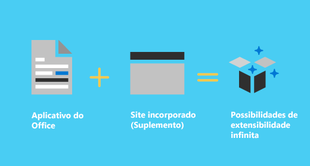
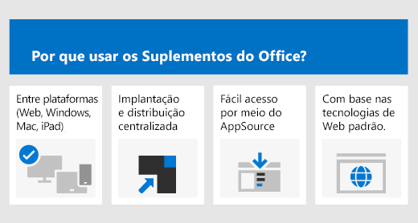

- [Visão geral da plataforma de suplementos do Office](#visão-geral-da-plataforma-de-suplementos-do-office)
- [Quais são as diferenças entre os suplementos do Office e os suplementos de COM e VSTO?](#quais-são-as-diferenças-entre-os-suplementos-do-office-e-os-suplementos-de-com-e-vsto)
- [Componentes de um suplemento do Office](#componentes-de-um-suplemento-do-office)
	- [Manifesto](#manifesto)
	- [Aplicativo Web](#aplicativo-web)
- [Estender os clientes do Office e interagir com eles](#estender-os-clientes-do-office-e-interagir-com-eles)
- [Estender a funcionalidade do Office](#estender-a-funcionalidade-do-office)

# Visão geral da plataforma de suplementos do Office

[Referência Externa](https://learn.microsoft.com/pt-br/office/dev/add-ins/overview/office-add-ins)

Use a plataforma de Suplementos do Office para criar soluções que estendem os aplicativos do Office e interagem com o conteúdo dos documentos do Office. Com os suplementos do Office, você pode usar tecnologias da Web conhecidas, como HTML, CSS e JavaScript para estender e interagir com o Outlook, Excel, Word, PowerPoint, OneNote e Project. Sua solução pode ser executada no Office em várias plataformas, insluindo no Windows, Mac, iPad e em um navegador.

Os suplementos do Office podem fazer quase tudo que uma página da Web pode fazer dentro do navegador. Use a plataforma de suplementos do Office para:

- **Adicione novas funcionalidades aos clientes do Office** - Traga dados externos para o Office, automatize documentos do Office, exponha funcionalidades da Microsoft e de outros clientes do Office e muito mais. Por exemplo, use a API do Microsoft Graph para se conectar a dados que inpulsionam a produtividade.

- **Crie novos objetos avançados e interativos que podem ser integrados em documentos do Office** - Mapas, gráficos e visualizações interativas integrados que os usuários podem adicionar a suas próprias planilhas do Excel e apresentações do PowerPoint.

# Quais são as diferenças entre os suplementos do Office e os suplementos de COM e VSTO?

Os suplementos de COM ou VSTO são soluções de integração anteriores do Office que são executadas apenas no Office no Windows. Ao contrário de suplementos de COM, os suplementos do Office não envolvem código executada no dispositivo do usuário ou no cliente do Office. Para um suplemento do Office, o aplicativo do cliente (por exemplo, o Excel), lê o manifesto do suplemento e conecta os comandos do meno e os botões da faixa de opções personalizada do suplemento à interface de usuário. Quando necessário, ele carrega o código de HTML e o JavaScript, que são executados no contexto de um navegador em uma área restrita.

Os suplementos do Office oferecem as seguintes vantagens em relação aos suplementos criados usando VBA, COM ou VSTO.

- Suporte à plataforma cruzada. Os suplementos do Office podem ser executados no Office na Web, Windows, Mac e iPad.
- Implantação e distribuição centralizadas. Os administradores podem implantar suplementos do Office centralmente em uma organização.
- Acesso fácil através da AppSource. Você pode disponibilizar sua solução para um público amplo ao enviá-la para o AppSource.
- Com base na tecnologia da Internet padrão. Você pode usar qualquer biblioteca que gosta para criar suplementos do Office.

# Componentes de um suplemento do Office

Um suplemento do Office inclui dois componentes básicos: um arquivo de manifesto XML e seu próprio aplicativo Web. O manifesto define várias configurações, incluindo como o suplemento é integrado a clientes do Office. O aplicativo Web deve ser hospedado em um servidor Web ou serviço de hospedagem na Web, como o Microsoft Azure.

## Manifesto

O manifesto é um arquivo XML que sepecifica configurações e recursos do suplemento, como os seguintes:

- O nome de exibição, a descrição, a ID, a versão e a localidade padrão do suplemento.
- Como o suplemento se integra ao Office.
- O nível de permmissão e os requisitos de acesso a dados para o suplemento

## Aplicativo Web

O suplemento do Office mais básico consiste em uma página HTML estática que é exibida dentro de um aplicativo do Office, mas não interage com o documento do Office nem com qualquer outro recurso de Internet. No entanto, para criar uma experiência que interaja com os documentos do Office ou permita que o usuário interaja com os recursos online de um aplicativo cliente do Office, você pode usar qualquer tecnologia, tanto do lado do cliente coo do servidor, a qual ser provedor de hospedagem dá suporte (como ASP.NET, PHP ou Node.js). Para interagir com clientes e documentos do Office,, você usa as APIs Office.js e JavaScript.

[Componentes de um suplemento Hello World.](../assets/images/about-addins-componentshelloworldoffice.png)

# Estender os clientes do Office e interagir com eles

Os suplementos do Office podem fazer o seguinte em um aplicativo cliente do Office.

- Estender a funcionalidade (qualquer aplicativo do Office)
- Criar novos objetos (Excel ou PowerPoint)

# Estender a funcionalidade do Office

Você pode adicionar novas funionalidades a aplicativos do Office por meio do seguinte:

- Botões de faixa de opções e comandos de menu personalizados (coletivamente chamados "comandos de suplementos")
- Painéis de tarefas inseríveis

Painéis personalizados de interface do usuário e de tarefa são especificados no manifesto do suplemento.