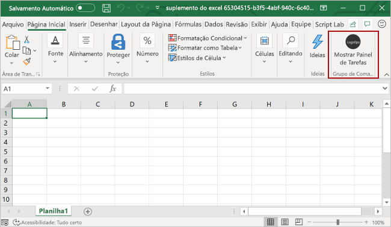
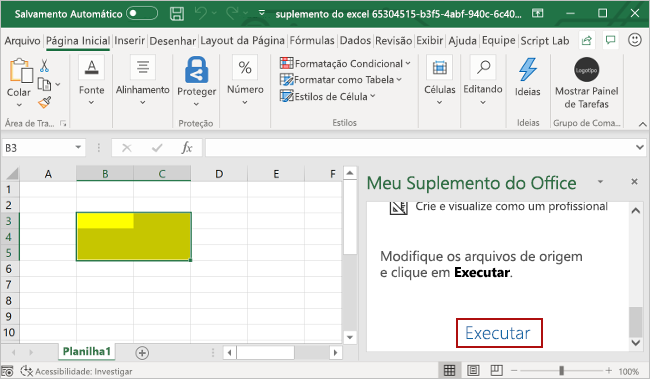

- [Criar um suplemento do painel de tarefas do Excel](#criar-um-suplemento-do-painel-de-tarefas-do-excel)
	- [Criar o suplemento](#criar-o-suplemento)
		- [pré-requisitos](#pré-requisitos)
		- [Criar o projeto do suplemento](#criar-o-projeto-do-suplemento)
		- [Explore o projeto](#explore-o-projeto)
		- [Experimente](#experimente)

# Criar um suplemento do painel de tarefas do Excel

[Referência Externa](https://learn.microsoft.com/pt-br/office/dev/add-ins/quickstarts/excel-quickstart-jquery?tabs=yeomangenerator)

Neste artigo, você passará pelo processo de criação de um suplemento do painel de tarefas do Excel.

## Criar o suplemento

Você pode criar um suplemento do Office usando o [Gerador Yeoman para suplementos do Office](https://learn.microsoft.com/pt-br/office/dev/add-ins/develop/yeoman-generator-overview) ou Visual Studio. O gerador Yeoman cria um projeto Node.js que pode ser gerenciado com o Visual Studio Code ou com qualquer outro editor, enquanto o Visual Studio cria uma solução do Visual Studio. Usaremos o desenvolvimento a partir do Yeoman.

### pré-requisitos

- [Node.js](https://nodejs.org/en/)
- A versão mais recente do [Yeoman](https://github.com/yeoman/yo) e do [Yeoman gerador de Suplementos do Office](https://learn.microsoft.com/pt-br/office/dev/add-ins/develop/yeoman-generator-overview). Para instalar essas ferramentas globalmente, execute o seguinte comando por meio do prompt de comando.

```npm install -g yo generator-office```

### Criar o projeto do suplemento

Execute o comando a seguir para criar um projeto de suplemento usando o gerador Yeoman.

```yo office```

Quando solicitado, forneça as informações a seguir para criar seu projeto de suplemento.

- Escolha o tipo de projeto: ```Office Add-in Task Pane project```
- Escolha o tipo de script: ```Javascript```
- Qual será o nome do suplemento? ```My Office Add-in```
- Você gostaria de proporcionar suporte para qual aplicativo cliente do Office? ```Excel```


Depois que você concluir o assistente, o gerador criará o projeto e instalará os componentes Note de suporte.

### Explore o projeto

O projeto de suplemento que você criou com o gerador Yeoman contém um código de exemplo para um suplemento básico do painel de tarefas. Se você quiser examinar os componentes do su projeto de suplemento, abra o projeto no seu editor de código e revise os arquivos listados abaixo. Quando estiver pronto para experimentar o suplemento, prossiga para a próxima seção.

- O arquivo **./manifest.xml** no diretório raiz do projeto define as configurações e os recursos do suplemento. Para saber mais sobre o arquivo **manifest.xml**, consulte [manifesto XML de suplementos do Office](https://learn.microsoft.com/pt-br/office/dev/add-ins/develop/add-in-manifests?tabs=tabid-1).
- O arquivo **./src/taskpane/taskpane.html** contém a marcação HTML do painel de tarefas.
- O arquivo **./src/taskpane/taskpane.css** contém o CSS que é aplicado ao conteúdo no painel de tarefas.
- O arquivo **./src/taskpane/taskpane.js** contém o código da API JavaScript do Office que facilita a interação entre o painel de tarefas e o aplicativo cliente do Office.

### Experimente

1. Navegue até a pasta raiz do projeto.

```cd "My Office Add-in"```

2. Conclua as etapas a seguir para iniciar o servidor da web local e fazer o sideload do seu suplemento.

- **Observação**: Os Suplementos do Office devem usar HTTPS, e não HTTP, mesmo durante o desenvolvimento. Se você for solicitado a instalar um certificado após executar um dos seguintes comandos, aceite a solicitação para instalar o certificado que o gerador do Yeoman fornecer. Você também poder executar o prompt de comando ou terminal como administrador para que as alterações sejam feitas

- Para testar o seu suplemento no Excel, execute o seguinte comando no diretório raiz do projeto. Isso inicia o servidor Web local e abre o Excel com seu suplemento carregado.

```npm start```

- Para testar o seu suplemento Excel em um navegador, execute o seguinte comando no diretório raiz do projeto. O servidor Web local é iniciado quando este comando é executado. Substitua "*{url}*" pelo URL de um documento do Excel no seu OneDrive ou uma biblioteca do SharePoint para qual você tenha permissões.

```npm run start:web -- --document {url}```

Se o suplemento não realizar o sideload no documento, realizar o sideload manual seguindo as instruç~eos nos [suplementos de sideload](https://learn.microsoft.com/pt-br/office/dev/add-ins/testing/sideload-office-add-ins-for-testing#manually-sideload-an-add-in-to-office-on-the-web) manualmente para Office na Web.

3. No excel, escolha a guia **Página Inicial** e o botão **Mostrar Painel de Tarefas** na faixa de opções para brir o painel de tarefas do suplemento.



4. Selecione um interfalo de células na planilha.

5. Na parte inferior do painel de tarefas, escolha o link **Executar** para definir a cor do intervalo selecionado como amarelo.

